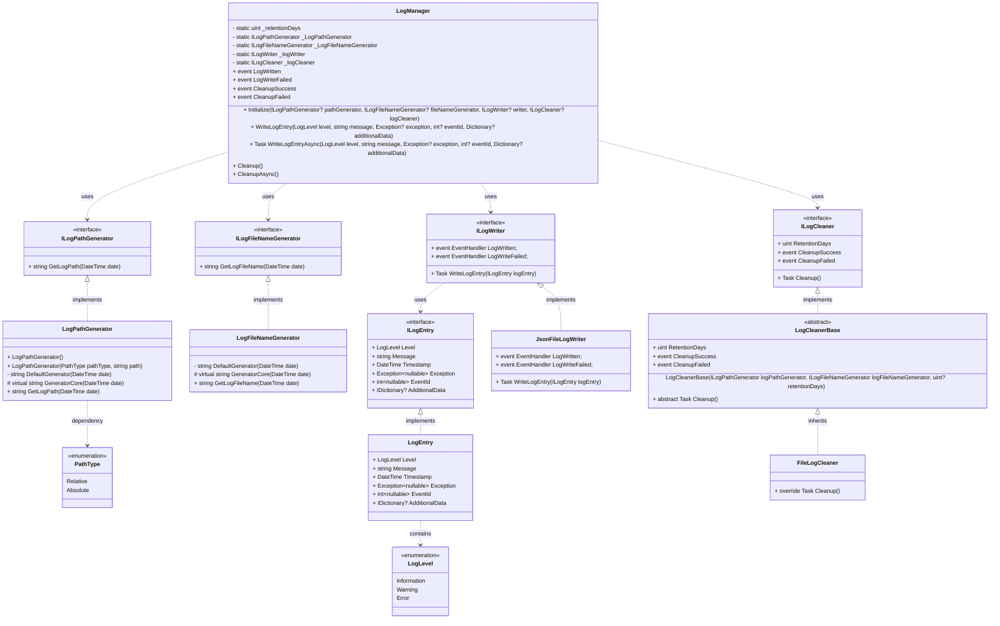

```mermaid
classDiagram
    class LogManager {
        - static uint _retentionDays
        - static ILogPathGenerator _LogPathGenerator
        - static ILogFileNameGenerator _LogFileNameGenerator
        - static ILogWriter _logWriter
        - static ILogCleaner _logCleaner
        + event LogWritten
        + event LogWriteFailed
        + event CleanupSuccess
        + event CleanupFailed
        + Initialize(ILogPathGenerator? pathGenerator, ILogFileNameGenerator? fileNameGenerator, ILogWriter? writer, ILogCleaner? logCleaner)
        + WriteLogEntry(LogLevel level, string message, Exception? exception, int? eventId, Dictionary<string, object>? additionalData)
        + Task WriteLogEntryAsync(LogLevel level, string message, Exception? exception, int? eventId, Dictionary<string, object>? additionalData)
        + Cleanup()
        + CleanupAsync()
    }

    class PathType {
        <<enumeration>>
        Relative
        Absolute
    }

    class ILogPathGenerator {
        <<interface>>
        + string GetLogPath(DateTime date)
    }

    class LogPathGenerator {
        + LogPathGenerator()
        + LogPathGenerator(PathType pathType, string path)
        - string DefaultGenerator(DateTime date)
        # virtual string GeneratorCore(DateTime date)
        + string GetLogPath(DateTime date)
    }

    class ILogFileNameGenerator {
        <<interface>>
        + string GetLogFileName(DateTime date)
    }

    class LogFileNameGenerator {
        - string DefaultGenerator(DateTime date)
        # virtual string GeneratorCore(DateTime date)
        + string GetLogFileName(DateTime date)
    }

    class ILogWriter {
        <<interface>>
        + Task WriteLogEntry(ILogEntry logEntry)
        + event EventHandler<ILogEntry> LogWritten;
        + event EventHandler<LogWriteFailedEventArgs> LogWriteFailed;
    }

    class JsonFileLogWriter {
        + Task WriteLogEntry(ILogEntry logEntry)
        + event EventHandler<ILogEntry> LogWritten;
        + event EventHandler<LogWriteFailedEventArgs> LogWriteFailed;
    }

    class ILogCleaner {
        <<interface>>
        + uint RetentionDays
        + Task Cleanup()
        + event CleanupSuccess
        + event CleanupFailed
    }

    class LogCleanerBase {
        <<abstract>>
        LogCleanerBase(ILogPathGenerator logPathGenerator, ILogFileNameGenerator logFileNameGenerator, uint? retentionDays)
        + uint RetentionDays
        + abstract Task Cleanup()
        + event CleanupSuccess
        + event CleanupFailed
    }

    class FileLogCleaner {
        + override Task Cleanup()
    }

    class ILogEntry {
        <<interface>>
        + LogLevel Level
        + string Message
        + DateTime Timestamp
        + Exception~nullable~ Exception
        + int~nullable~ EventId
        + IDictionary<string, object>? AdditionalData
    }

    class LogEntry {
        + LogLevel Level
        + string Message
        + DateTime Timestamp
        + Exception~nullable~ Exception
        + int~nullable~ EventId
        + IDictionary<string, object>? AdditionalData
    }

    class LogLevel {
        <<enumeration>>
        Information
        Warning
        Error
    }

    LogManager ..> ILogPathGenerator : uses
    LogManager ..> ILogFileNameGenerator : uses
    LogManager ..> ILogWriter : uses
    LogManager ..> ILogCleaner : uses
    ILogPathGenerator <|.. LogPathGenerator : implements
    ILogFileNameGenerator <|.. LogFileNameGenerator : implements
    ILogEntry <|.. LogEntry : implements
    ILogWriter ..> ILogEntry : uses
    ILogWriter <|.. JsonFileLogWriter : implements
    ILogCleaner <|.. LogCleanerBase : implements
    LogCleanerBase <|.. FileLogCleaner : inherits
    LogPathGenerator ..> PathType : dependency
    LogEntry ..> LogLevel : contains
```
