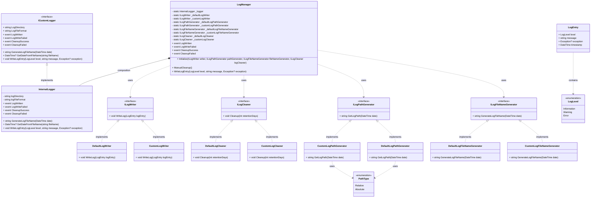

```mermaid
classDiagram
    class LogManager {
        - static InternalLogger _logger
        - static ILogWriter _defaultLogWriter
        - static ILogWriter _customLogWriter
        - static ILogPathGenerator _defaultLogPathGenerator
        - static ILogPathGenerator _customLogPathGenerator
        - static ILogFileNameGenerator _defaultLogFileNameGenerator
        - static ILogFileNameGenerator _customLogFileNameGenerator
        - static ILogCleaner _defaultLogCleaner
        - static ILogCleaner _customLogCleaner
        + event LogWritten
        + event LogWriteFailed
        + event CleanupSuccess
        + event CleanupFailed
        + Initialize(ILogWriter writer, ILogPathGenerator pathGenerator, ILogFileNameGenerator fileNameGenerator, ILogCleaner logCleaner)
        + ManualCleanup()
        + WriteLogEntry(LogLevel level, string message, Exception? exception)
    }

    class ICustomLogger {
        <<interface>>
        + string LogDirectory
        + string LogFileFormat
        + string GenerateLogFileName(DateTime date)
        + DateTime? GetDateFromFileName(string fileName)
        + void WriteLogEntry(LogLevel level, string message, Exception? exception)
        + event LogWritten
        + event LogWriteFailed
        + event CleanupSuccess
        + event CleanupFailed
    }

    class InternalLogger {
        - string logDirectory
        - string logFileFormat
        + string GenerateLogFileName(DateTime date)
        + DateTime? GetDateFromFileName(string fileName)
        + void WriteLogEntry(LogLevel level, string message, Exception? exception)
        + event LogWritten
        + event LogWriteFailed
        + event CleanupSuccess
        + event CleanupFailed
    }

    class ILogWriter {
        <<interface>>
        + void WriteLog(LogEntry logEntry)
    }

    class DefaultLogWriter {
        + void WriteLog(LogEntry logEntry)
    }

    class CustomLogWriter {
        + void WriteLog(LogEntry logEntry)
    }

    class ILogCleaner {
        <<interface>>
        + void Cleanup(int retentionDays)
    }

    class DefaultLogCleaner {
        + void Cleanup(int retentionDays)
    }

    class CustomLogCleaner {
        + void Cleanup(int retentionDays)
    }

    class ILogPathGenerator {
        <<interface>>
        + string GetLogPath(DateTime date)
    }

    class DefaultLogPathGenerator {
        + string GetLogPath(DateTime date)
    }

    class CustomLogPathGenerator {
        + string GetLogPath(DateTime date)
    }

    class ILogFileNameGenerator {
        <<interface>>
        + string GenerateLogFileName(DateTime date)
    }

    class DefaultLogFileNameGenerator {
        + string GenerateLogFileName(DateTime date)
    }

    class CustomLogFileNameGenerator {
        + string GenerateLogFileName(DateTime date)
    }

    class PathType {
        <<enumeration>>
        Relative
        Absolute
    }

    class LogEntry {
        + LogLevel level
        + string message
        + Exception? exception
        + DateTime timestamp
    }

    class LogLevel {
        <<enumeration>>
        Information
        Warning
        Error
    }

    LogManager ..> ILogWriter : uses
    LogManager ..> ILogPathGenerator : uses
    LogManager ..> ILogFileNameGenerator : uses
    LogManager ..> ILogCleaner : uses
    LogManager *-- InternalLogger : composition
    ICustomLogger <|.. InternalLogger : implements
    ILogWriter <|.. DefaultLogWriter : implements
    ILogWriter <|.. CustomLogWriter : implements
    ILogCleaner <|.. DefaultLogCleaner : implements
    ILogCleaner <|.. CustomLogCleaner : implements
    ILogPathGenerator <|.. DefaultLogPathGenerator : implements
    ILogPathGenerator <|.. CustomLogPathGenerator : implements
    ILogFileNameGenerator <|.. DefaultLogFileNameGenerator : implements
    ILogFileNameGenerator <|.. CustomLogFileNameGenerator : implements
    DefaultLogPathGenerator ..> PathType : uses
    CustomLogPathGenerator ..> PathType : uses
    LogEntry ..> LogLevel : contains
```
